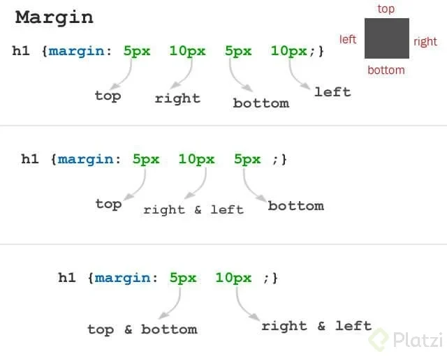
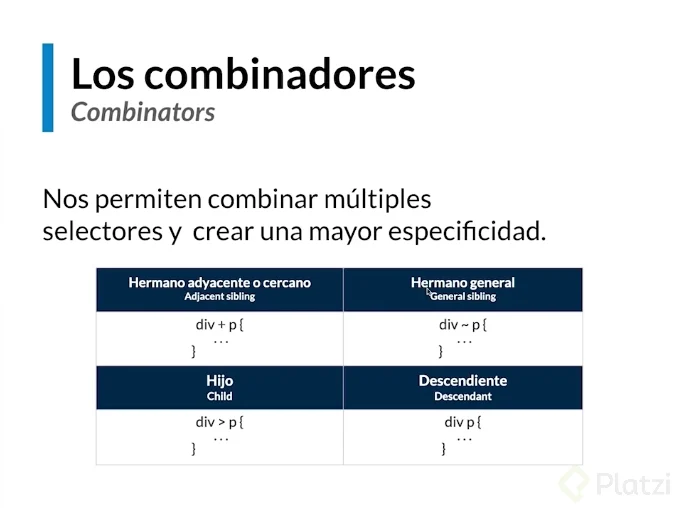
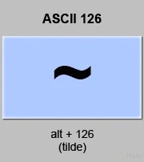
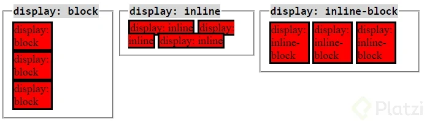
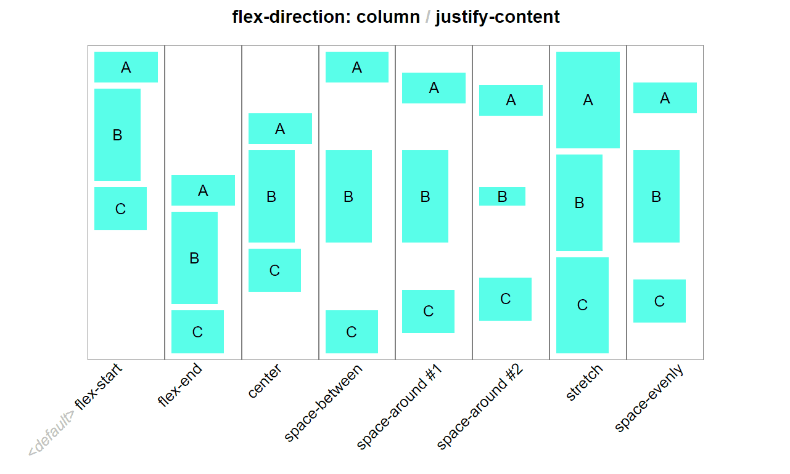
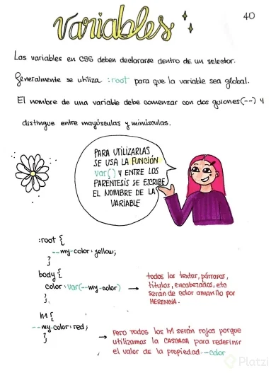

<h1>CSS</h1>

<h1>Tabla de Contenido</h1>

- [CSS](#css)
  - [Etiqueta - Selector - Class - ID](#etiqueta---selector---class---id)
    - [Otras formas de utilizar css en el proyecto](#otras-formas-de-utilizar-css-en-el-proyecto)
  - [Pseudo clases y pseudo elementos](#pseudo-clases-y-pseudo-elementos)
- [Anatomia de una regla de CSS](#anatomia-de-una-regla-de-css)
  - [Reglas](#reglas)
- [Modelo de caja](#modelo-de-caja)
- [Herencia](#herencia)
- [Orden de declaraci&oacute;n](#orden-de-declaración)
- [Adjacent Siblings | Combinators](#adjacent-siblings--combinators)
- [Combinadores: General Sibling](#combinadores-general-sibling)
- [Combinadores: Hijo y Descendiente](#combinadores-hijo-y-descendiente)
- [Medidas | Absolutas vs Realativas](#medidas--absolutas-vs-realativas)
- [Position](#position)
  - [Valores de position](#valores-de-position)
- [Display](#display)
- [Display Flex](#display-flex)
  - [Informacion para VCode](#informacion-para-vcode)
  - [Flexbox layouts](#flexbox-layouts)
- [Variables](#variables)
- [Web Fonts](#web-fonts)
  - [Fuentes](#fuentes)


# CSS

Cascading Style Sheets

* _Estilizar nuestro proyecto_

* __Html Es la estructura__

* __csss Es lo que se denomina lenguaje de hojas de estilo en cascada__

## Etiqueta - Selector - Class - ID

> Referenciar el proyecto 
```css 
<link rel="stylesheet" href="./css/style.css"> 
```


### Otras formas de utilizar css en el proyecto

```css
<style>
p {
    color: rgb(83, 83, 214);
    font-size: 30px;
  }
</style> 
```

Inyectarle un estilo a la etiqueta al atributo
```css
<main>
  <p style="color: red;">Soy yb texto</p>
</main> 
```

***css***

Generar e invocar estilo 

```css
/* Selector */
p {
  color: rgb(83, 83, 214);
  font-size: 30px;
}

/* class */
.parrafo {
  color: red;
}

/* ID */
#texto {
  color: yellow;
  font-size: 24px;
}
```

***HTML***

Generar estilo

```css
  <!-- Selector -->
  <link rel="stylesheet" href="./css/style.css">

    <!-- class -->
    <p class="parrafo">Soy un texto</p>

    <!-- ID -->
    <p id="texto">Soy un parrafo</p>
```

## Pseudo clases y pseudo elementos

ul: Es una caja

padding: Agregar un espacio interno

# Anatomia de una regla de CSS

* Selector _p_

> Declaration
* { property _color:_
* Property value _red;_
* Valor _rgb(255,0,0);_}

  ## Reglas

  [CSS Specificity calculator](https://www.codecaptain.io/tools/css-specificity-calculator)

    ```css
    !important

    inline styles

    #id

    .clase

    :estado

    []atributo

    *todos
    ```
  # Modelo de caja

  
  
  * Top     ⇡
  * Right   ⇢
  * Bottom  ⇣
  * Left    ⇠

    ## Caja

    Margen
    
    Color de fondo
    
    Imagen de fondo
    
    Rellemo 
    
    Borde

    Contenido

  
   
    ### Evitar conflictos con el navegador, agregar el siguiente codigo a nuestra hoja de estilo .css 

    ```css
     * {
      box-sizing: border-box;
      padding: 0;
      margin: 0;
    } 
    ```

  # Herencia

    > developer.mozilla.org _CSS proporciona cuatro valores de propiedad universales especiales para el control de la herencia. Todas las propiedades CSS aceptan estos valores. Establece que el valor de la propiedad que se aplica a un elemento determinado sea exactamente igual al del elemento padre. En la práctica, esto "activa la herencia"._

    > _La herencia también debe entenderse en este contexto: algunos valores de las propiedades CSS que se han establecido para los elementos padre los heredan los elementos hijo, pero otros no._

    > _Por ejemplo, si para un elemento se establece el color (color) y el tipo de letra (font-family), cada elemento que se encuentre dentro de él también se mostrará de ese color y con ese tipo de letra, a menos que les se haya aplicado un color y un tipo de letra diferentes directamente._


  # Orden de declaraci&oacute;n

  **1. Importancia**

    * Hoja de estilo de agente de usuario (Estilo de navegador)

    * Declaracion de normales en hojas de estilo de autor (Nuestro css)

    * Declaraciones importantes en hojas de estilos de autor (utilizar el !importatnt)

  **2. Especifidad**

    * La especificidad es la manera mediante la cual los navegadores deciden qué valores de una propiedad CSS son más relevantes para un elemento y, por lo tanto, serán aplicados. La especificidad está basada en las reglas de coincidencia que están compuestas por diferentes tipos de selectores CSS

  **3. Orden de las fuentes**

    * En tus estilos, las declaraciones al final del documento anulara a las que sucedan antes en caso de conflicto.

    Los ID no son recomendables para css, ya que pueden crear conflictos enel proyecto.

    

# Adjacent Siblings | Combinators

Combinators


  

.css
```css
h2 + p {
  color: red;
}
```

# Combinadores: General Sibling

Símbolo de virgulilla (~) ≫ Cómo poner con el teclado

.css

```css
h2 ~ p {
  color: red;
}
```



# Combinadores: Hijo y Descendiente

.css
```css
div > p {
  color: red;
}
```

Desendiente, que aplica a todas las etiquetas. Y la que se utiliza frecuentemente.
```css
div p {
  color: red;
}
```

# Medidas | Absolutas vs Realativas

> Absolutads

  * px
  * cm
  * pc
  * in
  * mm

> Relativas

 * %
 * em
 * rem root em
 * max-width | max-height
 * min-widtg | min-height
 * vw viewport width
 * vh viewport height

# Position

A Complete Guide to Flexbox
[CSS-TICKS](https://css-tricks.com/snippets/css/a-guide-to-flexbox/)

Juego donde aprenderas a escibir c&oacute;digo css
[FLEXBOX FROGGY](https://flexboxfroggy.com/#es)

## Valores de position

**Static:** Posición por defecto de los elementos, conservan la posición y espacio de donde son colocados (estáticos). No se puede usar top, right, bottom y left en esta posición.

**Absolute:** Permanecen en la posición de donde fueron colocados pero pierden su espacio físico (se sobreponen a los elementos que ocupan dicho espacio), se los puede posicionar mediante las propiedades top, right, bottom y left.

**Importante:** Al aplicar las propiedades top, right, bottom y left se tomará de referencia al contenedor más cercano con posición relativa.

**Relative:** Conservan su posición original y espacio físico pero se los puede posicionar mediante las propiedades top, right, bottom y left sin perder dicho espacio físico.

**Fixed:** Pierden su espacio físico y permanecen de forma fija (siguen el scroll, se colocan al lado izquierdo del viewport), se los puede posicionar mediante las propiedades de top, right, bottom y left.

**Sticky:** Conservan su espacio físico pero cuando el scroll los alcanza lo siguen (sin perder dicho espacio físico), es muy usado para barras de navegación y se lo puede posicionar con las propiedades top, right, bottom y left.

# Display

* display: block
* display: inline
* display: inline-block



[Custom properties (--*): CSS variables](https://developer.mozilla.org/en-US/docs/Web/CSS/--*)


# Display Flex

Mini guía de flexbox:

Propiedades en contenedores padre:
display:flex;
flex-direccion: row | column | row-reverse | column-reverse
flex-wrap: nowrap | wrap | wrap-reverse
Esta siguiente propiedad es un atajo para escribir el flex-direccion y el flex-wrap en una sola línea de código
flex-flow: Primero escribes dirección | Luego escribes flex-wrap
Posicionar horizontal
justify-content: flex-star | flex-end | center | space-around | space-between
Posicionar manera vertical
aling-items: flex-star | flex-end | center | stretch | baseline

aling-content: flex-star | flex-end | center | stretch | space-around | space-between “Aling-conten solo se utiliza varias filas de elementos, pero si es una sola línea usamos aling-items”

Propiedades en elemento hijo

order: ; Esto se utiliza para cambiar el orden de nuestros elementos sin cambiar el orden real semantico y correcto de html. Sencillamente colocando números.

aling-self: aling-items: flex-star | flex-end | center | stretch | baseline “Muy importante, si en el padre del elemento tiene declarado flex-direccion:row; esta propiedad lo acomodara verticalmente. Y si es flex.direccion: column lo ordenara horizontalmente”



Practicar Display

[Display-flex](https://flexboxfroggy.com/#es)

[Mastery Games](https://mastery.games/flexboxzombies/)


## Informacion para VCode

Un ejemplo de como usarlo [Emmet](https://docs.emmet.io/) para generar la estructura base del html de la clase ``` (div.box$.box>p{box$})*6 ```

```html
<div class="box1 box">
      <p>box1</p>
  </div>
  <div class="box2 box">
      <p>box2</p>
  </div>
  <div class="box3 box">
      <p>box3</p>
  </div>
  <div class="box4 box">
      <p>box4</p>
  </div>
  <div class="box5 box">
      <p>box5</p>
  </div>
  <div class="box6 box">
      <p>box6</p>
  </div>
</div>
```


Display flex

> Flex es uno de los nuevos valores HTML5 para propiedad CSS display, que nos permite maquetar nuestras páginas web de una manera mucho más fácil de lo que se hacía con la forma tradicional, en la que utilizábamos propiedades como float o position, entre otras.

> Un contenedor flexible se define usando los valores flex o inline-flex en la propiedad display . Cada hijo de un contenedor flex se convierte en un elemento flexible. Si hay texto directamente incluido en el contenedor flexible, se envuelve automáticamente en un elemento flexible anónimo.

style.css

```css
.container {
  border: 0.3rem solid black;
  display: flex;
  flex-wrap: wrap;
}
.box {
  height: 10rem;
  flex-basis: 10rem;
  flex-grow: 1;
```
## Flexbox layouts
```css
.container {
  border: 0.3rem solid black;
  display: flex;
  flex-wrap: wrap;
}
.box {
  height: 10rem;
  flex-basis: 10rem;
  flex-grow: 1;
```
# Variables

En CSS, las propiedades personalizadas (también conocidas como variables) son entidades definidas por autores de CSS que contienen valores específicos que se pueden volver a utilizar en un documento. ... Las variables CSS permiten que un valor se almacene en un lugar y luego se haga referencia en varios otros lugares.



Enlaces

[MATERIAL DESING](https://material.io/resources/icons/?style=baseline)

[Font Awesome](https://fontawesome.com/)

[Google Fonts](https://fonts.google.com/)

[font-family](https://developer.mozilla.org/en-US/docs/Web/CSS/font-family)

Declara Variables

```css
:root {
  --primary-color: #003476; 
  --secundary-color: #b4d2f7;
  --header-size: 4rem;
  --font: 1.8rem;
}
```
Utilizar las Variables declaradas

```css
header {
  width: 100vw;
  height: 15vh;
  background-color: var(--primary-color);
}

h1 {
  font-size: var(--header-size);
  color: var(--secundary-color);
}

```

# Web Fonts

Buena pr&aacute;ctica

  * Solo cargar 1 fuente por proyecto

  * Importarlas siempre en la etiqueta head

## Fuentes

[FontPair](https://fontpair.co)

[GoogleFonts](https://fonts.google.com/specimen/Langar?sidebar.open=true&selection.family=Langar)
