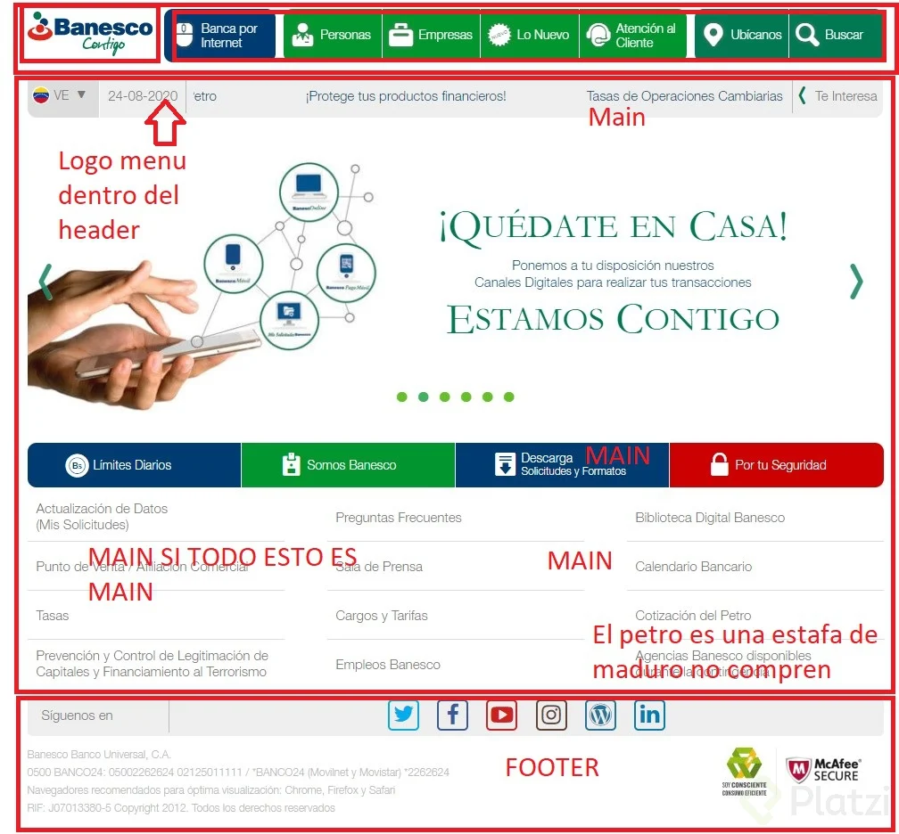
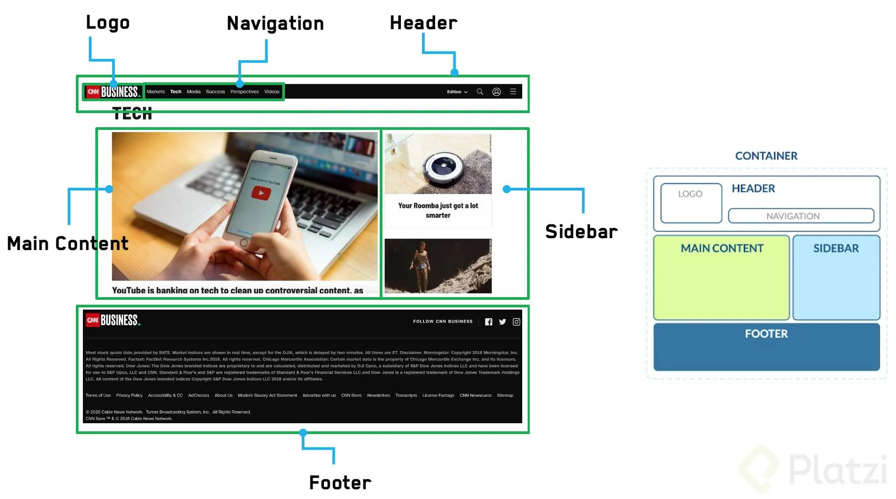
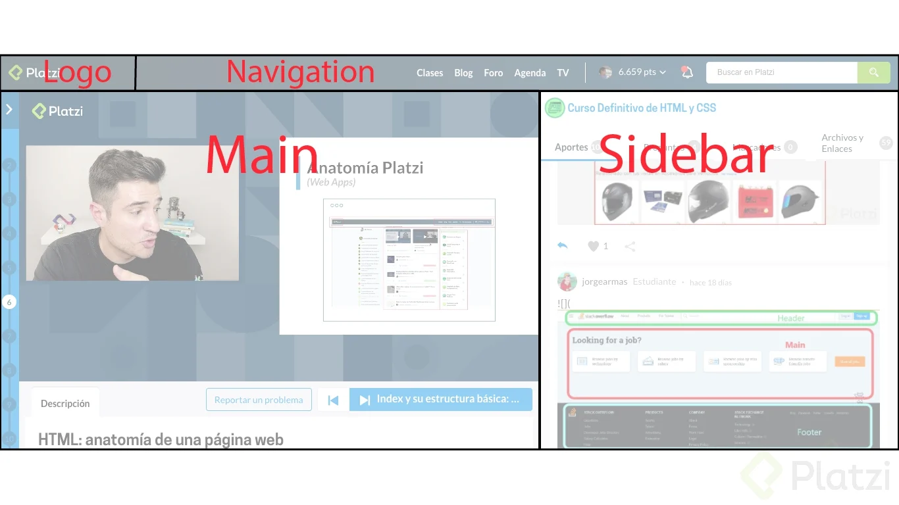
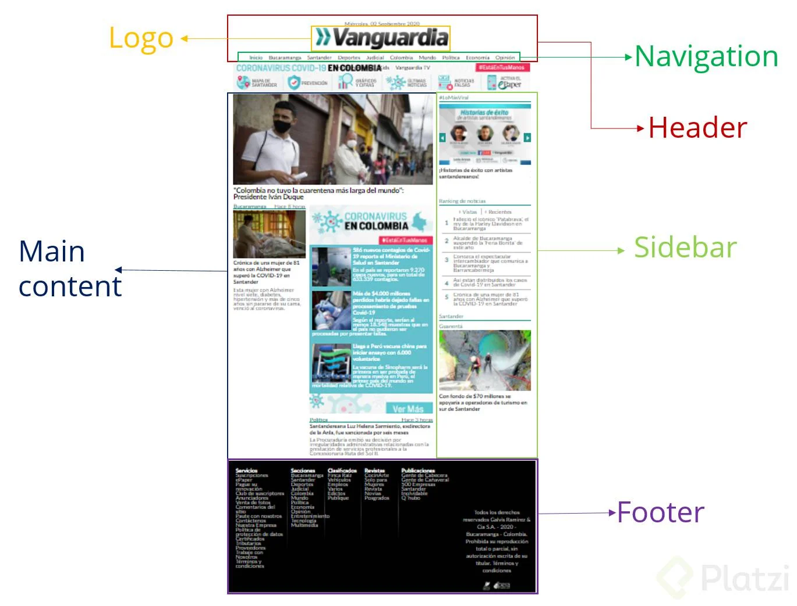
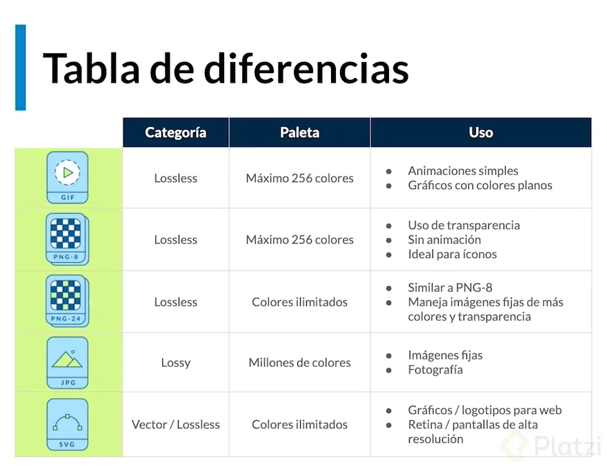

# HTML

[html y CSS](https://www.notion.so/Curso-definitivo-de-HTML-y-CSS-7196d473c6b046d2b8de4a0edaa82dc6)

La web se conforma de tres conceptos:

    URL => Uniform Resource Locator.
    HTTP => Protocolo de transferencia de hipertexto.
    HTML

HTML es el código que se utiliza para estructurar el contenido de tu web, y darle sentido y propósito.

HTML son siglas, Hyper Text Markup Language (Lenguaje de Marcado de Hipertexto).
Hyper Text  significa que el texto tiene interactividad, conexión con otros documentos.
_Markup_ significa que le pone etiquetas a los elementos. Por eso también se le conoce como un lenguaje de etiquetas.
HTML es un lenguaje interpretado.
HTML es un estándar, así que no importa desde que navegador, que dispositivo se ejecute, es lo mismo en cualquier sitio. Sigue siendo el mismo código.

Anatomia de HTML

* Estructura: Anatomia de HTML

No. 1



No. 2()



No. 3



No.4



# Etiqueta multimedia

## Tipos de Imgenes 

Tabla de difrencias en las imagenes




> .jpg Comprimir las imagen al nivel estandar  que es de 100kb a 70kb, lo recomendable.

> .png para Logo

> .svg para Logo


# _*Sitios para reducir el tamano de imagines*_

*[TinyPNG](https://tinypng.com/)*

*[Ver y quitar Exif online](https://www.verexif.com/)*

*[PicResize](https://picresize.com/)*


## **Sitos para Descargar imagenes libres**

*[Unsplash](https://unsplash.com/)*


*[Pixels](https://www.pexels.com/es-es/)*

# Etiquetas 

__img__

**Figure** 

***Developer.morzilla.org***

> Figure: Representa contenido independiente, a menudo con un título. Si bien se relaciona con el flujo principal, su posición es independiente de éste. 

> El elemento figcaption representa un título o leyenda de un fragmento de contenido ( figure ). Un elemento figure representa a un trozo de documento autocontenido que se usa habitualmente para encerrar imágenes, gráficos, tablas de referencia, videos, poemas, fragmentos de código, etc

*  El elemento 
```html 
<alt=" ">
```` 
atributo HTML para un texto que describe una imagen

```html
<Figure> 
  
</figure>
<figcaption></figcaption>
```
__Video__

Etiequeta video: atributos

* ***Controls:*** Agrega al video los controles para reproducir, pausar y adelantar

* ***Prelod="auto":*** Hace que el navegador cargue el video, al acceder a la pagina

* ***source:***  especifica recursos de medios múltiples para los elementos ``` <picture> , <audio> , o <video> ```. Es un elemento vacío. Normalmente se utiliza para servir el mismo contenido multimedia en varios formatos soportados por diferentes navegadores

```html
<video controls preload="auto"><source src="" /></video>
```

## Form e input

Form es una etiqueta de HTML que representa un formulario. En este formulario se agregan los diferentes campos de entrada de datos o de confirmación, así como los botones, que como mínimo ha de haber uno, el de envío.

* label

* span

* input

* id

* placehoder


***Estructura de un form***

```html
<form>
  <label for="nombre">
    <span>Cual es tu nombre?</span>
    <input type="text" id="nombre" placeholder="Tu nombre"/>
  </label>
</form>
```
## Crear calendario

Crear un calendario 

```html
<form action="">
  <label for="">
    <span>Calendario</span>
    <input type="datetime-local" id="calendario" name="calendario" />
    <input type="submit" />
  </label>
</form>
```

## Formulario para datos personales del Usuario

* autocomplete: Toma los datos del navegador del usurio y llena los campos. ```
<autocomplete="name">```
* required: El usuario no puede enviar los datos, si le hace falta una casilla. ```
<required> ``` 

```html
<form action="">
  <label for="nombre">
    <span>Cual es tu nombre?</span>
    <input type="text" name="nombre" id="nombre" autocomplete="name" required />
  </label>
</form>
```

## Select
* Esta es una manera convencional de utilizar select, pero no es la recomendable.

* Etiqueta ```<select>:``` Esta permite crear la lista, con las etiquetas ```<option>:```

```html
<main>
  <select name="cursos" id="">
    <option value="JavaScript">JavaScript</option>
    <option value="HTML5">HTML5</option>
    <option value="CSS3">CSS3</option>
    <option value="Web Standards">Web Standards</option>
  </select>
</main>
```
# Select

**Etiqueta ```<input list = “”>:``` De este modo, se puede utilizar una etiqueta ```<datalist>``` con etiquetas ```<option>``` dentro del input. De este modo, el usuario puede escribir dentro del input, y filtrar los resultados de la lista:**

## Forma correcta

* Agregar al ```<input list="" /> ```

```html
<main>
 <input list="cursos">
    <datalist id="cursos">
      <option value="JavaScript"></option>
      <option value="HTML5"></option>
      <option value="CSS3"></option>
      <option value="Web Standards"></option>
      <option value="Python"></option>
    </datalist>>
</main>
```
## Input typ submit vs Button

> Lo utilizaremos solo en los formularios ``` <input type="submit" value=" "> ```

> Lo utilizaremos en cualquier otro tipo de boton dentro de nuestro proyecto ``` <button>Que te gusta?</button> ```
