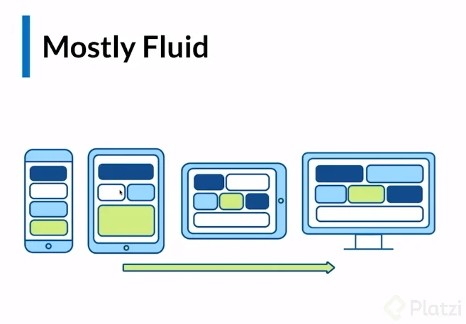
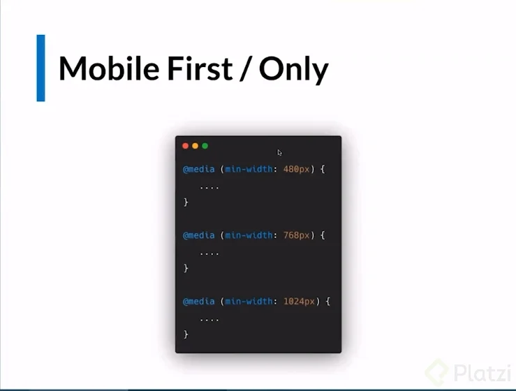
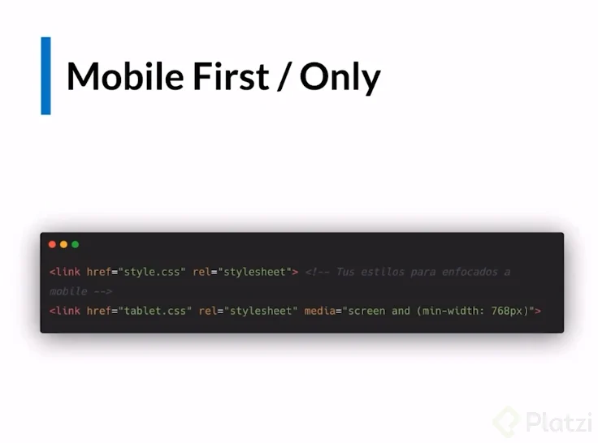
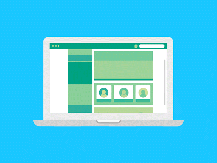
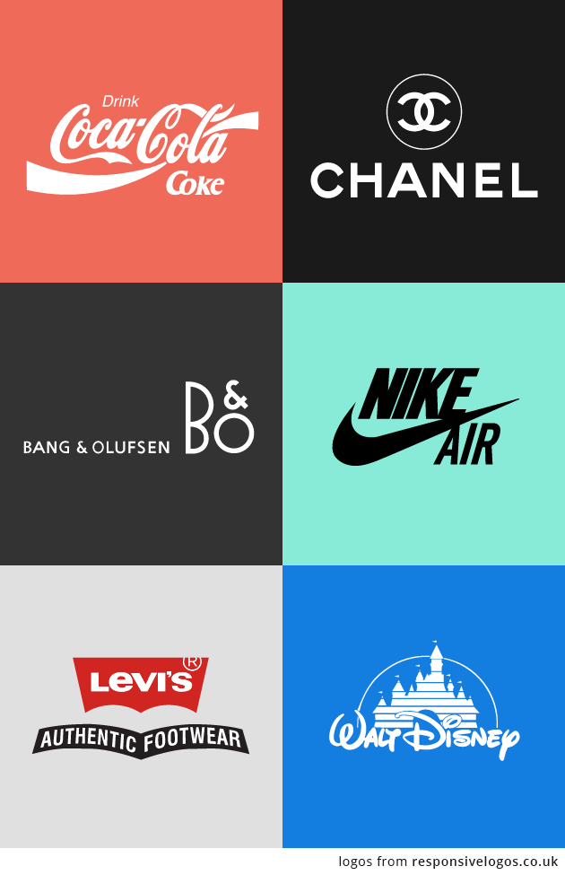
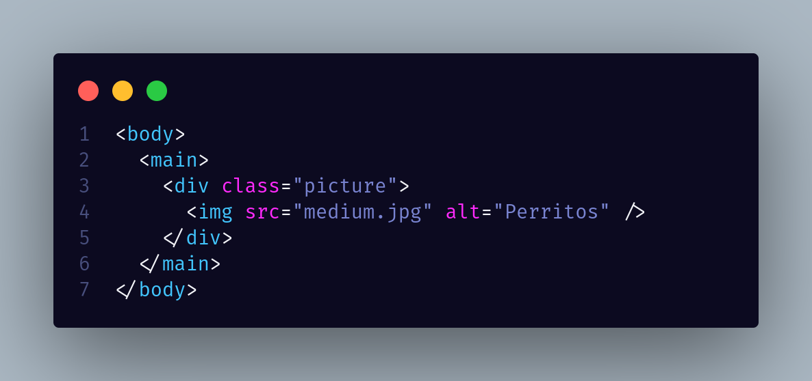
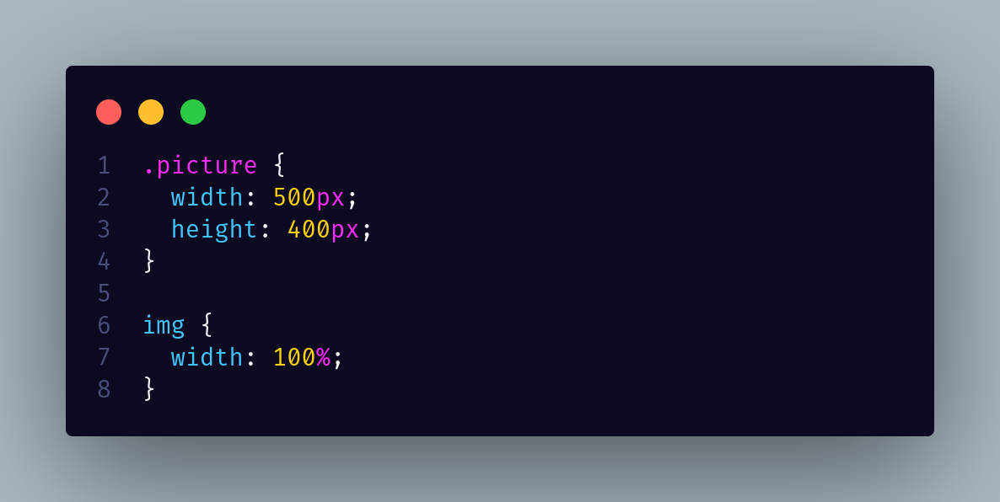

# Estrategias de responsive | Mostly fluid

## Patrones de maquetaci&oacute;n Responsive Desing

> Son todas esas técnicas que usamos para adaptar nuestras aplicaciones web a la mayor cantidad de pantallas



Se debe optimizar para todos los dispositivos. Hay tiene que tener en claro un par de conceptos:

  * **Break points**: cuando la pantalla sea de cierto tamaño, se generará un cambio para reposicionar o redimensionar los contenedores.

  * **Media Queries**: son condicionales. No es la mejor práctica pero aplicándolo al CSS: ` @media (min-width: #;) {"código que se aplicará"} ` y se aplican para cada tamaño de dispositivo. El pixelaje dado será el break point.

Lo más importante es diseñar para movil. Por lo que se debe diseñar con mobile first. Es decir, primero diseñar para celular, luego un break point para tablet y finalmente un break point para PC.

Para aplicar media queries con buenas prácticas, hay que hacerlo en el header. Porque así solo se descarga el código necesario según el dispositivo, mientras que en CSS se descarga todo sin importar nada.

En la tag link se colocan los atributos href, rel y, a partir del segundo archivo, el break point media="screen and (min-width: #px". El style.css debe estar hecho para mobile. Luego se pueden crear otros archivos como tablet.css o desktop.css.


* **Mostly Fluid**: El patrón Mostly fluid consiste, principalmente, en una cuadrícula fluida. Por lo general, en las pantallas grandes o medianas se mantiene el mismo tamaño y simplemente se ajustan los márgenes en las más anchas.

* **Column drop**: En el caso de los diseños con varias columnas de ancho completo, durante el proceso de colocación de columnas éstas únicamente se colocan de forma vertical debido a que el ancho de la ventana es demasiado reducido para el contenido.

* **Layout shifter**: El patrón Layout shifter es el más adaptable, ya que posee varios puntos de interrupción en diferentes anchos de pantalla.
Enlaces

* **Tiny tweaks**: El patrón Tiny tweaks permite realizar pequeños cambios en el diseño, como ajustar el tamaño de la fuente, cambiar el tamaño de las imágenes o desplazar el contenido de maneras muy poco significativas.

* **Off canvas**: En lugar de apilar contenido verticalmente, el patrón Off canvas coloca contenido menos usado (tal vez menús de navegación o de apps) fuera de la pantalla y solo lo muestra cuando el tamaño de la pantalla es suficientemente grande.

[Web](https://developers.google.com/web/fundamentals/design-and-ux/responsive/patterns)


Crear capturas del c&oacute;digo desde Visual studio code con [Code snap](https://dev.to/ruslangonzalez/crear-capturas-del-codigo-desde-visual-studio-code-con-codesnap-13hb)

**Extenciones Visual studio Code**

[CodeSnap](https://marketplace.visualstudio.com/items?itemName=adpyke.codesnap)

[Polacode](https://marketplace.visualstudio.com/items?itemName=pnp.polacode)

[carbon](https://carbon.now.sh/)

  ## Meida Queries

  What is Mobile First Design? Why It’s Important & How To Make It? [Mobile 1st Desing](https://medium.com/@Vincentxia77/what-is-mobile-first-design-why-its-important-how-to-make-it-7d3cf2e29d00)

  _[MeidaQyeries](https://mediaqueri.es/)_

  

  

  

# Layout Shifter CSS

Layout Shifter utiliza [GitHub](https://github.com/)

# Column Drop

Column Drop utliza [Dropbox](https://www.dropbox.com/es/)


# Recomendaci&oacute;n

Separa siempre tus archivos de CSS por break point

*  mobile.css | style.css

* tablet.css

* desktop.css

Compare devices

Mobile devices, in Responsive Web Design, relate to a core value which is the value of CSS width or ` ("device-width") `, in CSS Device Independant Pixels, which depends both of the browser and user zoom settings. 


**Sitios web que inplementan responsive**

[mydevice.io](https://www.mydevice.io/)

[SMASHING-MAGAZINE](https://www.smashingmagazine.com/)

[dibbble](https://dribbble.com/)

# Im&aacute;genes responsive




## Manera no recomendable de trabajar con las imagenes.

* Documento HTML



* Documento CSS



## Forma recomendable de trabajar con las imagenes responsive

* HTML

```html
<body>
  <main>
    <picture>
      <source media="(min-width:1300px)" srcset="large.jpg" /> <!-- Imagen grande -->
      <source media="(min-width:1000px)" srcset="medium.jpg" /> <!-- Imagen mediana -->
       <!-- Imagen por defecto -->
    </picture>
  </main>
</body>
```

* CSS

```css
img {
  width: 100%;
}
```

# Accesibilidad

Producto para todos!

[htmlreference.io](https://htmlreference.io/)

[all The Tags](https://allthetags.com/)

[is a CSS Guru](https://jgthms.com/)
[]()

## Sem&aacute;ntica

Semántica

La semántica está relacionada con las etiquetas contenedoras en HTML5, por ejemplo: header, main, sidebar y footer. Estas agregan información importante para aquellos que tengan problemas con la visualización de la página. Les permite a estos usuarios orientarse en qué sección de la página se encuentran.

  > Por eso, es importante utilizar las diferentes etiquetas que HTML5 ofrece para tener la mejor semántica posible y la accesibilidad.


  * HTML Semántico es usar las etiquetas de html en lugar de usar muchos div.

  * La semántica nos indica en que sección del documento nos encontramos y esto es muy importante cuando implementamos la accesibilidad en nuestra aplicación web.
  
  * La etiqueta div, debe usarse, cuando haya una etiqueta de html, para la sección que quieras implementar.

## Texto

> Se recomienda fuertemente usar medidas relativas como rem, para poder incrementar el tamaño del texto para personas con visibilidad disminuida. Las opciones de navegador que cambian el tamaño de las fuentes no funcionan cuando las fuentes de html en el texto están en pixeles (px).

Muy buenos datos!!!

`62.5% = 10px (en base al navegador)`

`1rem = 10px`

`1.6rem = 16px`

[Creating Accessible Forms](https://webaim.org/techniques/forms/)

[Keyboard Accessibility](https://webaim.org/techniques/keyboard/)

[Contrast and Color Accessibility](https://webaim.org/articles/contrast/)

[Contrastes en Web](https://www.notion.so/Contraste-en-Web-c5f242b0cc114401aaca8b615d3a8e32)

  ## Labels, alt y title

Labels | alt | title
---|:---:|---:
Labels en los inputs que utilicemos (se usa mucho en formularios) - Si quieres saber mas sobre lables te dejo este par de recursos: `label - MDN y HTML <label> Tag` | El atributo `alt (en las imágenes)` - El **alt** facilita que un una persona con limitación visual que usa un software para leer la página web pueda escuchar de que se trata la imagen. | El atributo title que se usa en la etiqueta de anchor `(<a>)` y en la etiqueta imagen `()`.


Un punto importante de **Accesibilidad** no solo hay que pensar en nosotros, hay que pensar en los demás usuarios que podrían incluso tener una capacidad diferente.
En este curso me lleve mucho aprendizaje, pero esta lección es la mas importante.
Y desde ahora daré lo mejor de mi para ofrecer servicios al alcance de todos.